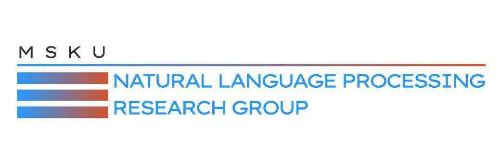
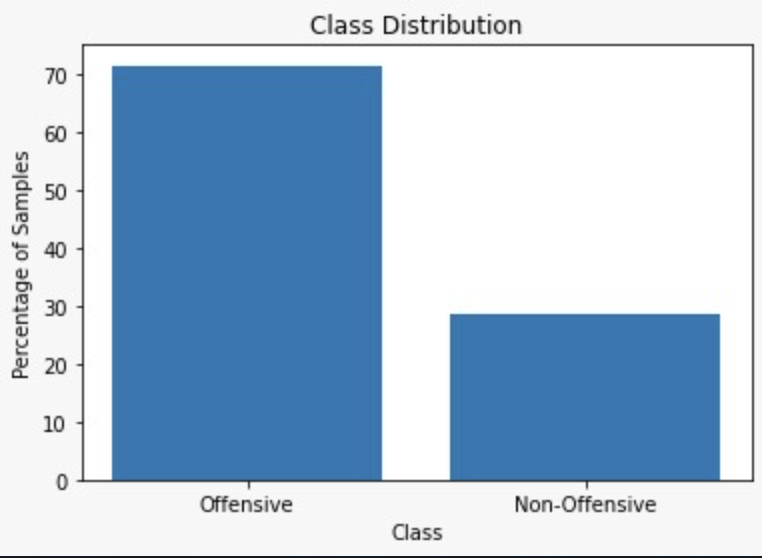
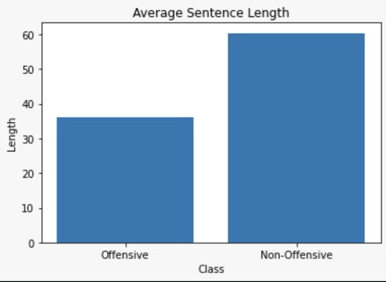
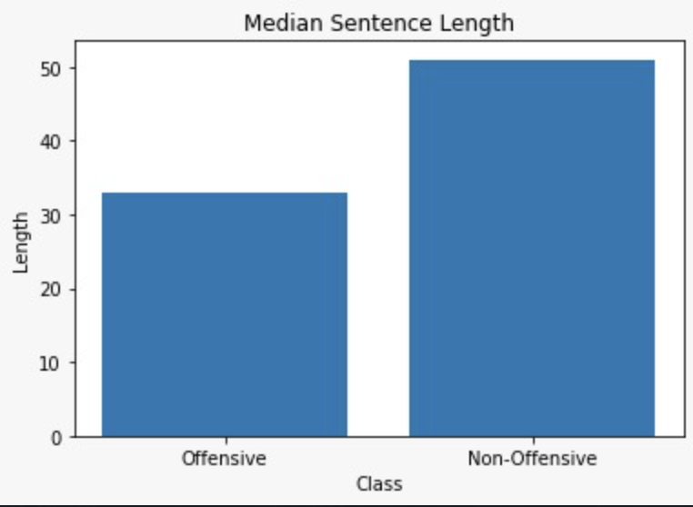

## MSKU-CENG-NLP-2-Final

# Projenin Amacı

Aşağılayıcı Söylem Tespiti Projesi, günümüzde giderek artan çevrimiçi iletişim ortamlarında karşılaşılan aşağılayıcı söylemlerin tespitinin ne kadar önemli olduğunu gösteren bir örnektir. Bu projede, doğal dil işleme yöntemleri kullanılarak aşağılayıcı söylemlerin tespiti amaçlanmıştır. Proje için oluşturulan veri kümesi, aşağılayıcı söylem içerip içermediğine ve içeriyorsa hangi alt kategoride (cinsiyetçi, ırkçı, küfür veya hakaret) olduğuna dair etiketlenmiştir. Bu sayede, projenin sonuçları hem çevrimiçi ortamların güvenliği hem de insanların psikolojik sağlığı açısından oldukça önemlidir.

# Veri Önişleme
   

Bu proje için kullanılan veri kümesi öncelikle önişleme işlemlerinden geçirilmiştir. Bu işlemler, metin verilerini daha iyi anlaşılır hale getirmek ve daha iyi sonuçlar elde etmek için yapılmaktadır.Önişleme adımları şu şekildedir:
1."re" kütüphanesi kullanılarak, metin verilerindeki gereksiz karakterler ve sayılar kaldırılmıştır.
2.Tüm metinler küçük harflere dönüştürülmüştür.
3.Her bir metnin ilk 5 kelimesi alınmıştır.Bu veri önişemedeki en önemli adımımız çünkü burda modelin daha yalın ve özgün bir veri kümesi üzerinde çalışmasını sağlıyoruz.
4.Eşit sayıda örnek her bir kategori için ayrılmıştır.
Bu önişleme işlemleri, daha temiz ve anlaşılır veriler elde edilmesine yardımcı olmuştur. Bu veriler, proje için kullanılan modelin daha yüksek performans elde etmesini sağlamaktadır.

# Veri Dengesizliği
   

Veri seti dengesizliklerini gidermek için scikit-learn kütüphanesinde yer alan resample() fonksiyonunu kullandık. Öncelikle, is_offensive kolonunda değeri 0 olan verilerin aynı sayıda örnek içerecek şekilde rastgele örneklem alınarak yeni bir dengeleştirilmiş veri seti oluşturduk. Ardından, eğitim setimizde de aynı işlemi uygulayarak sınıf dengesizliğini düzelttik. Bunun için, azınlık sınıfındaki örnekleri alarak, diğer sınıflardan örneklerle eşit sayıda örnek içeren yeni bir veri seti oluşturduk.
Bunun yanı sıra, eğitim setimizdeki 'OTHER' sınıfı dışındaki diğer sınıflardan örnekler alarak, "offensive" olarak adlandırdığımız bir sınıf oluşturduk. Böylece, modelimizin sadece ayrımcı, cinsiyetçi, ırkçı veya küfürlü metinleri sınıflandırması için eğitim yapmasını sağladık.
Son olarak, oluşturduğumuz yeni veri setlerindeki örnekleri rastgele karıştırarak, daha iyi bir öğrenme için verinin rastgeleliğini artırdık ve bu adımlar sayesinde, modelin performansı önemli ölçüde artırıldı.

# MODEL EĞİTİMİ 
Sınıflandırma işlemi iki aşamada gerçekleştirildi. İlk aşamada, veriler "offensive" ve "nonoffensive" olmak üzere iki sınıfa ayrıldı. Bu ayrım için scikit-learn kütüphanesinde yer alan MultinomialNB() sınıflandırıcısı kullanıldı. Verilerin vektörlere dönüştürülmesi için ise CountVectorizer() sınıfı kullanıldı.

İkinci aşamada, diğer sınıflar ile dengeli bir veri seti oluşturmak için her sınıftan 900 örnek seçildi ve bu örneklerle bir train veri seti oluşturuldu. Bu train veri seti, Hugging Face tarafından geliştirilen BERT modeli kullanılarak sınıflandırıldı.

Farklı Modellerin Performans Karşılaştırılması
Proje için denediğimiz modeller tablo halinde gösterilmiştir.
 
Bu modeller arasında veri setimize en uygun olan iki model MultinominalNB ve BERT modeli olarak seçilerek aşağılayıcı söylemlerin tespit edilmesi işlemi gerçekleştirilmiştir.

# Farklı Modellerin Performans Karşılaştırılması
Proje için denediğimiz modeller tablo halinde gösterilmiştir.

Bu modeller arasında veri setimize en uygun olan iki model MultinominalNB ve BERT modeli olarak seçilerek aşağılayıcı söylemlerin tespit edilmesi işlemi gerçekleştirilmiştir.

# Gereksinimler

Bu projeyi kullanmak için aşağıdakilere ihtiyacınız olacak:

* Python 3
* pandas
* scikit-learn
* Gradio

# Kullanım

1.Depoyu yerel makinenize kopyalayın.
2.Gerekli paketleri aşağıdaki komutu çalıştırarak yükleyin:
3.Sevdiğiniz Python IDE'sinde NLPEvaluation_MSKU-CENG-NLP-2.py dosyasını açın.
4.Gradio sunucusunu başlatmak için betiği çalıştırın.
5.Web tarayıcınızda Gradio URL'sine gidin.
6.Duygu analizi modelini değerlendirmek için kendi veri kümenizi yükleyin.
7.Değerlendirmenin tamamlanmasını bekleyin.
8.Değerlendirme sonuçlarını içeren output_MSKU-CENG-NLP-2.csv dosyasını indirin.

# Lisans

Bu proje MIT Lisansı altında lisanslanmıştır. Ayrıntılar için LICENSE dosyasına bakın.

# Teşekkürler

Bu proje MSKU-CENG-NLP-2 takımı tarafından oluşturulmuştur. Eğitim verilerini sağlayan teknofest_train_final.csv veri kümesine özel teşekkürler.
